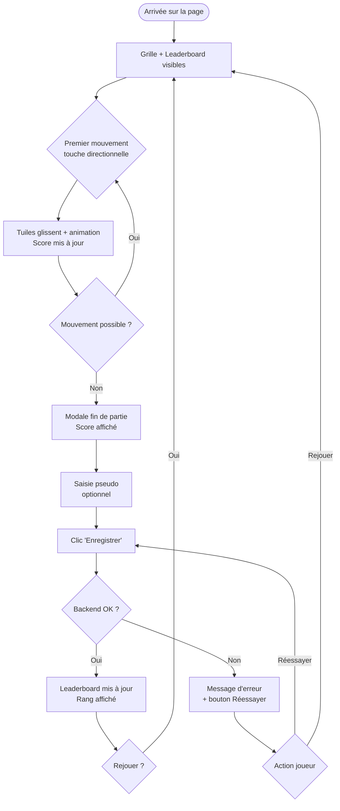
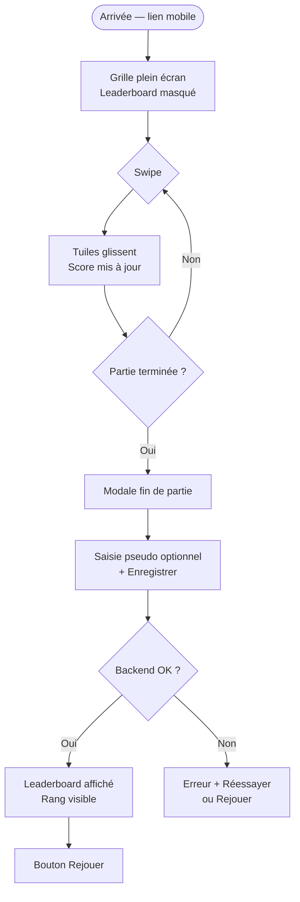
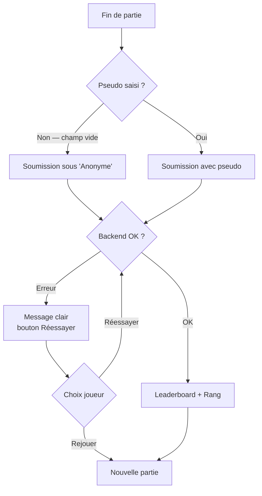

# UX Design Specification test-bmad

**Author:** Thomas
**Date:** 2026-03-14

---

<!-- UX design content will be appended sequentially through collaborative workflow steps -->

## Executive Summary

### Project Vision

**test-bmad** est un jeu 2048 en ligne au design pastel soigné, accompagné d'un leaderboard public. Construit en HTML/CSS/JS vanilla (frontend) et Python FastAPI (backend), déployé sur Render.com. Le vrai livrable du projet n'est pas le jeu — c'est la méthode de collaboration humain-IA acquise par Thomas sur l'ensemble du cycle de développement, reproductible sur n'importe quel projet futur.

### Target Users

**Thomas — Le Développeur-Apprenant**
Pilote du projet. Cherche à vivre un cycle complet de développement IA-assisté : conception → code → déploiement → sécurité. Le succès se mesure à sa compréhension de chaque décision technique prise.

**Le Joueur Anonyme**
Toute personne recevant un lien. Profil : curieux, occasionnel, pas forcément gamer. Friction acceptable : zéro. Il arrive, voit le jeu, joue, soumet son score, voit son rang. Pas d'inscription, pas d'attente.

### Key Design Challenges

1. **Zéro friction d'accueil** — le joueur doit pouvoir jouer en moins de 2 secondes, sans inscription ni popup d'accueil.
2. **Layouts adaptatifs distincts** — desktop affiche grille + leaderboard en simultané ; mobile affiche la grille en plein écran pendant la partie, le leaderboard seulement après.
3. **Fluidité de la fin de partie** — la modale de soumission doit être claire et non bloquante : pseudo optionnel, bouton "Rejouer" toujours visible, gestion d'erreur gracieuse.

### Design Opportunities

1. **Identité visuelle forte** — la palette pastel + motifs géométriques peut créer une expérience mémorable qui distingue ce 2048 des clones génériques.
2. **Le badge "Made with AI"** — élément de storytelling à valoriser visuellement, pas juste un disclaimer discret.
3. **Le moment "leaderboard"** — voir son rang après soumission est le pic émotionnel du parcours joueur ; ce moment mérite un soin particulier dans l'animation et la mise en scène.

---

## Core User Experience

### Defining Experience

L'action principale est le jeu — déplacer des tuiles. Mais l'action *critique* à ne pas rater est la **soumission du score + découverte de son rang** : c'est le moment émotionnel fort du parcours. Si cette séquence est fluide, tout le reste suit.

### Platform Strategy

- **Plateforme :** Web (navigateur), pas d'app native
- **Desktop :** clavier (touches directionnelles)
- **Mobile :** swipe tactile
- **Offline :** non requis
- **Support :** navigateurs modernes uniquement (Chrome, Firefox, Safari, Edge — 2 dernières versions majeures)

### Effortless Interactions

- **Démarrer une partie** — zéro clic préalable, la grille est là dès l'arrivée sur la page
- **Déplacer une tuile** — réponse instantanée, pas de latence perçue
- **Soumettre son score** — pseudo optionnel, un seul bouton, pas de formulaire lourd ; le joueur peut ignorer et rejouer sans friction

### Critical Success Moments

1. **Premier coup** — la tuile bouge immédiatement, le joueur comprend le jeu sans explication
2. **Fin de partie** — la modale apparaît naturellement, score visible en évidence, invitation douce à entrer son pseudo
3. **Voir son rang** — le leaderboard se met à jour, le joueur voit sa position → moment "aha" et envie de rejouer

### Experience Principles

1. **Immédiateté** — aucun écran intermédiaire entre l'arrivée et le premier coup
2. **Fluidité mécanique** — les tuiles répondent sans friction, jeu sans hiccup perçu
3. **Récompense claire** — chaque fin de partie aboutit à un rang visible, pas juste un score dans le vide
4. **Design qui raconte** — le badge "Made with AI" et l'esthétique pastel participent à l'expérience, pas juste à la décoration

---

## Desired Emotional Response

### Primary Emotional Goals

- **Pour le joueur** : Amusement immédiat, légèreté, et ce petit frisson de compétition quand on voit le leaderboard — *"allez, encore une partie"*
- **Au moment clé (voir son rang)** : Satisfaction + surprise agréable — le joueur réalise qu'il s'est mesuré à d'autres sans l'avoir vraiment cherché

### Emotional Journey Mapping

| Moment | Émotion cible |
|---|---|
| Arrivée sur la page | Curiosité + confiance immédiate (c'est propre, ça donne envie) |
| Premier coup de tuile | Engagement — "ça répond, c'est fluide, je continue" |
| En pleine partie | Flow — concentration, légèreté, plaisir mécanique |
| Fin de partie | Satisfaction + douceur — pas de punition, juste un bilan |
| Soumission + rang | Fierté ou amusement — selon le rang, pas de déception forcée |
| Erreur backend | Sérénité — message clair, pas d'anxiété, toujours en contrôle |

### Micro-Emotions

- **Confiance** (vs confusion) — le design pastel soigné doit rassurer immédiatement sur la qualité
- **Flow** (vs anxiété) — les tuiles glissent, rien ne bloque, on reste dans la zone
- **Légèreté** (vs pression) — c'est un jeu casual, pas compétitif à outrance ; le ton reste détendu
- **Fierté douce** (vs frustration) — le rang est une récompense, même en bas du classement

### Design Implications

- **Confiance** → Design soigné dès le premier pixel, pas de clutter, hiérarchie visuelle claire
- **Flow** → Animations tuiles rapides et smooth (< 100ms), pas de freeze perceptible
- **Légèreté** → Palette pastel, typographie aérée, badge "Made with AI" traité avec humour et bienveillance
- **Fierté douce** → Leaderboard mis en scène après soumission, pas juste un tableau brut

### Emotional Design Principles

1. **Confiance immédiate** — le design communique la qualité avant même le premier coup
2. **Zéro friction émotionnelle** — aucun moment où le joueur se sent bloqué, confus ou jugé
3. **Récompense sans conditions** — le rang est toujours valorisant, le bouton "Rejouer" toujours accessible
4. **Légèreté assumée** — le ton visuel et textuel reste détendu, humain, légèrement ludique

---

## UX Pattern Analysis & Inspiration

### Inspiring Products Analysis

**2048 original (Gabriele Cirulli)**
- ✅ Grille centrée, immédiateté totale — rien d'autre à l'écran
- ✅ Score en haut, toujours visible, mis à jour en temps réel
- ❌ Design brut, aucune personnalité visuelle
- ❌ Fin de partie abrupte, pas de mise en scène

**Monument Valley**
- ✅ Palette pastel douce, géométrie élégante — confiance visuelle immédiate
- ✅ Animations fluides qui renforcent le sentiment de qualité
- ✅ Chaque interaction a un retour satisfaisant (mouvement + feedback visuel)

**Wordle (NY Times)**
- ✅ Layout ultra-simple, une seule chose à faire à l'écran
- ✅ Partage social naturel après la partie — le leaderboard joue ce rôle ici
- ✅ Animation de révélation des cases → moment de satisfaction visuelle

**Duolingo (home screen)**
- ✅ Zéro friction d'entrée — le CTA principal est immédiatement visible
- ✅ Feedback positif pour chaque petite victoire

### Transferable UX Patterns

**Layout / Navigation :**
- Grille centrée en hero, leaderboard en sidebar sur desktop (pattern Wordle/2048)
- Mobile : une seule colonne, grille plein écran — sidebar disparaît

**Interactions :**
- Animation de slide des tuiles avec légère courbe d'accélération (Monument Valley)
- Highlight visuel quand deux tuiles fusionnent — micro-délice mécanique
- Modale fin de partie avec animation d'entrée douce (pas un flash brutal)

**Visuel :**
- Fond géométrique subtil (lignes ou formes légères en arrière-plan)
- Tuiles avec dégradés pastels légers par valeur — chaque palier a sa couleur
- Badge "Made with AI ✨" en coin, discret mais visible — style Wordle "NY Times"

### Anti-Patterns to Avoid

- Popup d'accueil / splash screen — tue l'immédiateté
- Score uniquement visible en fin de partie — frustrant pendant le jeu
- Modale de soumission trop lourde (formulaire multi-champs)
- Animations trop lentes ou trop showy — casse le flow

### Design Inspiration Strategy

**À adopter :**
- Grille centrée immédiatement accessible (2048 original) — supporte l'immédiateté
- Animations fluides et légères (Monument Valley) — supporte le flow et la confiance

**À adapter :**
- Leaderboard post-partie sur mobile (Wordle) — simplifié en Top 10 sans partage social
- Feedback positif de fin d'action (Duolingo) — version douce, sans excès de confettis

**À éviter :**
- Ecran d'accueil intermédiaire — ne correspond pas au principe d'immédiateté
- Animations blocantes ou transitions longues — ne correspond pas au principe de fluidité mécanique

---

## Design System Foundation

### Design System Choice

**CSS Custom (vanilla)** — système de design entièrement sur-mesure, sans framework ni dépendance externe.

### Rationale for Selection

- La stack est HTML/CSS/JS vanilla sans build step : le CSS custom est la suite architecturale naturelle
- L'identité visuelle pastel + tuiles colorées par valeur nécessite un contrôle fin que seul le CSS custom offre efficacement
- Avec l'IA comme partenaire de développement, générer du CSS propre et structuré est rapide
- Zéro dépendance = zéro risque de conflit, de surcharge réseau ou de version obsolète

### Implementation Approach

- Variables CSS comme design tokens : `--color-tile-2`, `--color-tile-4`, `--color-bg`, `--color-accent`, etc.
- Un fichier `style.css` structuré en sections claires : reset, layout, grille/tuiles, leaderboard, modale, responsive
- Un breakpoint principal mobile/desktop (ex: `768px`)

### Customization Strategy

- Palette pastel définie en variables CSS globales — facile à ajuster sans toucher au CSS fonctionnel
- Couleurs de tuiles définies par palier (2, 4, 8, 16... 2048) avec dégradés légers
- Fond géométrique via CSS (pattern SVG inline ou CSS `background-image` avec motif répété)

---

## User Journey Flows

### Parcours 1 — Joueur Desktop (succès complet)



### Parcours 2 — Joueur Mobile (swipe)



### Parcours 3 — Edge Cases



### Journey Patterns

- **Entry pattern** : zéro friction — pas d'écran d'accueil, la grille est l'entry point direct
- **Feedback pattern** : chaque action a une réponse visuelle immédiate (animation tuile + score incrémenté)
- **Recovery pattern** : toujours deux sorties en cas d'erreur — Réessayer + Rejouer
- **Completion pattern** : la modale est la seule interruption de flow, légère et non bloquante

### Flow Optimization Principles

- Le pseudo est post-placé (après la partie) — ne bloque jamais l'entrée en jeu
- "Rejouer" est toujours accessible, même en cas d'erreur — l'utilisateur garde le contrôle
- Le leaderboard mobile n'apparaît qu'après la partie — la grille occupe tout l'écran pendant le jeu

---

## Component Strategy

### Design System Components

Stack CSS vanilla — pas de design system avec composants prêts à l'emploi. Tous les composants sont custom, construits avec les variables CSS et tokens définis dans la fondation visuelle.

**Fondation CSS :**
- Reset CSS + variables globales (`:root`) — tokens couleurs, spacing, border-radius, fonts
- Typographie — hiérarchie h1–h3, body, labels
- Boutons — primary, secondary, états hover/focus/disabled

### Custom Components

**Phase 1 — Critiques (jeu jouable)**

**`GameGrid`** — Grille 4×4
- Anatomy : conteneur grille + 16 cellules
- États : cellule vide, cellule avec valeur (2→2048+), cellule en fusion (flash)
- Accessibilité : `role="grid"`, `aria-label="Grille de jeu 2048"`

**`Tile`** — Tuile avec valeur
- États : apparition (scale-in), déplacement (transition position), fusion (pulse + nouvelle couleur)
- Variants : une couleur par palier de valeur (2 à 2048+)
- Animation : `transition: transform 80ms ease-out`

**`ScoreBox`** — Affichage du score
- Anatomy : label + valeur
- États : idle, incrémentation (micro-animation +N)
- Variants : Score courant / Meilleur score

**`GameOverModal`** — Modale fin de partie
- Anatomy : overlay + carte (score, input pseudo, bouton Enregistrer, bouton Rejouer)
- États : visible/caché, chargement soumission, erreur soumission
- Accessibilité : `role="dialog"`, `aria-modal="true"`, focus trap

**Phase 2 — Supportants (parcours complet)**

**`Leaderboard`** — Liste Top 10
- Anatomy : titre + liste de `LeaderboardRow`
- `LeaderboardRow` : rang (médaille or/argent/bronze top 3), pseudo, score, date
- États : chargement, vide, rempli, mis à jour (highlight nouvelle entrée)

**`ErrorMessage`** — Retour d'erreur
- Anatomy : icône + texte + bouton Réessayer
- Variants : inline (dans modale)

**Phase 3 — Polish**

**`AIBadge`** — Badge "Made with AI"
- Anatomy : emoji + texte, coin fixe de l'interface
- Décoratif uniquement

### Component Implementation Strategy

- Variables CSS en `:root` comme unique source de vérité pour couleurs et tokens
- Composants construits sans dépendance externe — HTML sémantique + CSS + JS vanilla
- Animations via CSS transitions (pas JS) pour les performances
- Accessibilité : ARIA labels, focus trap sur la modale, contraste ≥ 4.5:1

### Implementation Roadmap

| Phase | Composants | Priorité |
|---|---|---|
| 1 | GameGrid, Tile, ScoreBox | Jeu jouable — critique |
| 2 | GameOverModal, Leaderboard | Parcours complet joueur |
| 3 | ErrorMessage, AIBadge | Polish et robustesse |

---

## UX Consistency Patterns

### Button Hierarchy

| Niveau | Usage | Style |
|---|---|---|
| **Primary** | Action principale (Enregistrer mon score) | `background: #8B7BA8` · texte blanc · border-radius 10px |
| **Secondary** | Action alternative (Rejouer, Réessayer) | `background: #F5F0EB` · texte `#3D3540` · même shape |
| **Ghost** | Actions non critiques futures | Border 1px `#8B7BA8` · texte mauve |

Règle : jamais deux boutons primary côte à côte — toujours une hiérarchie claire.

### Feedback Patterns

| Situation | Pattern |
|---|---|
| Fusion de tuiles | Flash CSS (scale 1.1 → 1.0) + changement de couleur immédiat |
| Score incrémenté | Micro-animation `+N` qui monte et disparaît |
| Soumission en cours | Bouton désactivé + texte "Enregistrement…" |
| Soumission réussie | Leaderboard mis à jour, rang de l'utilisateur highlighté |
| Erreur backend | Message inline dans la modale, rouge doux `#E87070`, icône ⚠️ |
| Fin de partie | Modale avec animation `scale-in` douce (0.9 → 1.0, 150ms) |

### Form Patterns

- Seul formulaire : champ pseudo dans la modale fin de partie
- Placeholder `"Ton pseudo (optionnel)"` — pas de label flottant
- Validation UX : max 20 caractères (validation sécurité côté backend)
- Soumission via `Enter` ou clic bouton
- Champ vide = soumission sous "Anonyme" — aucun message d'erreur

### Navigation Patterns

- SPA single-view — pas de navigation multi-page
- États : en jeu / modale ouverte / leaderboard mobile visible
- Retour à l'état de jeu toujours via "Rejouer"

### Additional Patterns

**États de chargement et vides :**

| Situation | Pattern |
|---|---|
| Chargement initial leaderboard | Lignes skeleton (3 barres grises animées) |
| Leaderboard vide | Message "Sois le premier !" |
| Erreur chargement leaderboard | Message discret "Classement indisponible" — ne bloque pas le jeu |

**Pattern modal :**
- Ouverture : `scale(0.95) → scale(1)` + `opacity 0 → 1`, durée 150ms
- Fermeture : uniquement via "Rejouer" (pas de croix, pas d'overlay click) — guide intentionnellement vers la suite
- Focus trap actif pendant l'ouverture

---

## Responsive Design & Accessibility

### Responsive Strategy

Deux expériences distinctes, pas une seule qui se réduit :

**Desktop (≥ 768px)**
- Layout 2 colonnes : grille (~60%) + leaderboard sidebar (~40%)
- Max-width `960px`, centré horizontalement avec padding `32px`
- Score visible en haut de la grille en permanence
- Contrôles : touches directionnelles clavier

**Mobile (< 768px)**
- Layout 1 colonne : grille occupe toute la largeur, leaderboard masqué pendant le jeu
- Grille scalée pour tenir dans la viewport sans scroll
- Score affiché en haut, compact
- Contrôles : swipe tactile (touchstart/touchend)
- Leaderboard affiché uniquement après fin de partie

**Tablet (768px–1023px)**
- Suit le layout desktop si ≥ 768px — sidebar leaderboard réduite
- Swipe tactile activé en plus du clavier

### Breakpoint Strategy

Un seul breakpoint principal : **`768px`** (approche mobile-first)

```css
/* Mobile d'abord — layout 1 colonne */
.layout { display: block; }

/* Desktop — layout 2 colonnes */
@media (min-width: 768px) {
  .layout { display: flex; }
}
```

### Accessibility Strategy

Cible : **WCAG AA**

| Critère | Décision |
|---|---|
| Contraste texte | ≥ 4.5:1 sur tous les fonds pastels |
| Taille cibles tactiles | Boutons ≥ 48×48px sur mobile |
| Navigation clavier | Touches directionnelles pour le jeu, Tab pour les éléments interactifs |
| Focus visible | Outline `2px solid #8B7BA8` sur tous les éléments focusables |
| ARIA | `role="grid"` sur la grille, `role="dialog"` sur la modale, `aria-live` sur le score |
| HTML sémantique | `<main>`, `<section>`, `<h1>`, `<button>` — pas de divs cliquables |

### Testing Strategy

- **Responsive** : Chrome DevTools (mobiles simulés) + test manuel sur iPhone/Android
- **Accessibilité** : axe DevTools (extension Chrome) ; test navigation clavier ; vérification contraste avec Color Contrast Analyzer
- **Navigateurs** : Chrome, Firefox, Safari, Edge (dernières versions majeures)

### Implementation Guidelines

- Unités relatives : `rem` pour les tailles, `%` et `vw/vh` pour les dimensions de la grille
- Grille CSS scalable : `grid-template-columns: repeat(4, 1fr)` avec `width: min(80vw, 400px)`
- Touch events : `touchstart` + `touchend` avec calcul de delta X/Y pour détecter la direction du swipe
- Pas d'images décoratives sans `alt=""` — le fond géométrique est en CSS pur (aucun ``)

---

## Design Direction Decision

### Design Directions Explored

6 directions ont été générées et visualisées dans `ux-design-directions.html` :
1. Pastel Classique — fond crème chaud, 2 colonnes, sobre et aéré
2. Soft Dark — fond sombre prune, tuiles lumineuses, ambiance premium
3. Minimaliste Blanc — fond blanc pur, beaucoup d'espace, typographie forte
4. Géométrique Bold — fond quadrillé visible, cadres marqués, accents violet
5. Carte Centrée — tout dans une carte, compact, mobile-first
6. Sunset Warm — tons abricot/corail/or, chaud et énergique

### Chosen Direction

**Direction 1 — Pastel Classique**

Fond crème chaud (`#F5F0EB`), layout 2 colonnes (grille + leaderboard), design sobre et aéré. Tuiles dégradant du pêche clair au violet profond selon la valeur. Leaderboard sur fond blanc en sidebar.

### Design Rationale

- Direction la plus alignée avec la vision initiale du projet (palette pastel soignée)
- Layout 2 colonnes naturel sur desktop — grille et leaderboard visibles simultanément sans friction
- Fond crème chaud plus chaleureux et mémorable qu'un blanc pur, sans être aussi engageant qu'un dark theme
- Tuiles pastel progressives — lisibles, satisfaisantes visuellement, cohérentes avec l'identité légère et friendly

### Implementation Approach

- Variables CSS définies en `:root` pour toute la palette et les couleurs de tuiles
- Layout desktop via CSS Grid ou Flexbox (60/40 — grille/sidebar)
- Fond de page : `#F5F0EB` ; Surface (grille, modale, leaderboard) : `#FFFFFF`
- Border-radius généreux (12-16px) sur toutes les surfaces pour maintenir la douceur visuelle

---

## 2. Core User Experience

### 2.1 Defining Experience

> **"Glisser une tuile et voir deux nombres fusionner en un seul, plus grand."**

C'est l'interaction cœur — simple, immédiate, addictive. Tout le reste du produit gravite autour de ce geste.

### 2.2 User Mental Model

- Le joueur arrive avec le modèle du 2048 original ou d'un jeu de puzzle — il s'attend à une grille, des flèches, et une logique de fusion intuitive
- Il ne lit pas les règles — il joue et comprend en 2-3 coups
- Frustration potentielle : une tuile qui ne répond pas, un lag perceptible, ou une fin de partie non annoncée clairement

### 2.3 Success Criteria

- La tuile se déplace en < 100ms après la touche/swipe
- La fusion est visuellement évidente (animation + changement de couleur du palier)
- Le score se met à jour immédiatement après chaque mouvement
- La fin de partie est détectée et signalée sans délai

### 2.4 Novel UX Patterns

Le jeu utilise des patterns établis et bien compris — c'est une force. Pas besoin d'éduquer l'utilisateur. La valeur ajoutée : soigner l'exécution (fluidité, esthétique pastel, feedback visuel) bien au-delà du 2048 original.

### 2.5 Experience Mechanics

| Phase | Ce qui se passe |
|---|---|
| **Initiation** | La grille est visible dès l'arrivée — aucun clic pour commencer |
| **Interaction** | Touche directionnelle (desktop) ou swipe (mobile) → toutes les tuiles glissent dans la direction |
| **Feedback** | Animation de slide fluide, flash de fusion sur les tuiles qui s'assemblent, score incrémenté |
| **Completion** | Fin de partie détectée → modale douce avec score final + invitation à entrer son pseudo |

---

## Visual Design Foundation

### Color System

**Palette pastel — design tokens CSS :**

| Rôle | Valeur | Usage |
|---|---|---|
| `--color-bg` | `#F5F0EB` | Fond de page principal (crème chaud) |
| `--color-surface` | `#FFFFFF` | Grille, modale, leaderboard |
| `--color-grid-bg` | `#E8E0D8` | Fond de la grille de jeu |
| `--color-cell-empty` | `#D4C9BE` | Cellules vides |
| `--color-primary` | `#8B7BA8` | Boutons, accents (mauve pastel) |
| `--color-success` | `#7DB5A0` | Fusion, score, rang (vert sauge) |
| `--color-text` | `#3D3540` | Texte principal (prune foncé) |
| `--color-text-light` | `#8A7E8A` | Labels secondaires, dates |

**Tuiles par valeur (dégradé pastel clair → chaud) :**
`2` pêche clair → `4` abricot → `8` corail → `16` rose → `32` mauve → `64` lavande → `128+` violet profond

### Typography System

- **Titres / Score :** `'Nunito'` ou `'Poppins'` — arrondi, moderne, friendly (Google Fonts CDN)
- **Corps / Leaderboard :** `'Inter'` ou `system-ui` — lisible, neutre, performant
- **Échelle :** `12px` labels → `16px` corps → `20px` sous-titres → `32px` score → `48px` tuiles

### Spacing & Layout Foundation

- **Base :** `8px` — toutes les marges et paddings sont des multiples de 8
- **Desktop :** layout 2 colonnes (grille ~60% | leaderboard ~40%), `max-width: 960px` centré
- **Mobile :** 1 colonne, grille plein écran, padding minimal `16px`
- **Border-radius :** `12px` tuiles, `16px` modale, `8px` boutons — cohérent avec le ton doux

### Accessibility Considerations

- Contraste texte/fond ≥ 4.5:1 sur toutes les combinaisons pastel
- Focus visible sur tous les éléments interactifs (outline coloré)
- Labels ARIA sur la grille et le formulaire de soumission
- Contrôles clavier natifs (touches directionnelles) sans JavaScript supplémentaire nécessaire

**À adopter :**
- Grille centrée immédiatement accessible (2048 original) — supporte l'immédiateté
- Animations fluides et légères (Monument Valley) — supporte le flow et la confiance

**À adapter :**
- Leaderboard post-partie sur mobile (Wordle) — simplifié en Top 10 sans partage social
- Feedback positif de fin d'action (Duolingo) — version douce, sans excès de confettis

**À éviter :**
- Ecran d'accueil intermédiaire — ne correspond pas au principe d'immédiateté
- Animations blocantes ou transitions longues — ne correspond pas au principe de fluidité mécanique
